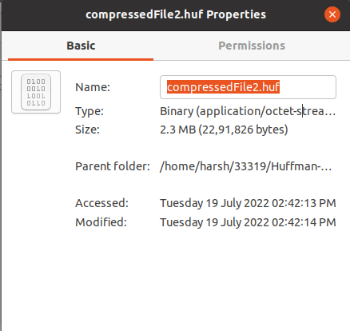

# Huffman-Compressor
Created a C++ compression and decompression application able to compress a text file and reduce it’s file size. The compression technique is based upon variable sized huffman-coding and decoding.

## Features :
  - Users can compress files.
  - Users can decompress files.

